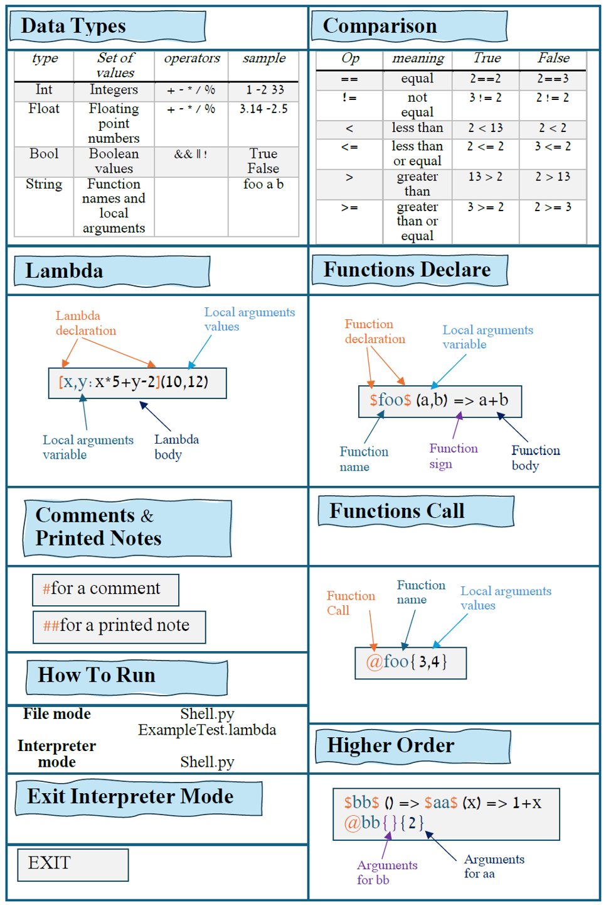

# Interpreter

### Students

1. Sapir Gilany 
2. Idan Noyshul 

## Table of Contents

* [How To Run](#how-to-run)
* [Basic Commands](#basic-commands---cheatsheet)
* [BNF](#bnf)
* [Use can Diagram - interpreter](#use-case-diagram)
* [System](#system)
* [Parser](#parser-)
* [Interpreter](#interpreter).
 

## How To Run
<summary><b>Instructions </b></summary>

1. To run the interpreter run in the terminal:

    ```sh
    python shell.py
    ```

2. To run the interpreter with the example run in the terminal:

    ```sh
    python shell.py ExampleTest.lambda
    ```

3. To run the testing unit:

    ```sh
    python Testing.py 
    ```

4. To exit from the interpreter mode:
    ```sh
    EXIT
    ```


## Basic Commands - CheatSheet

<p>
  
</p>


## BNF

<details><summary><b>Show BNF</b></summary>

Here is our BNF, a formal notation used to define the syntax of our programming languages, that explains the language rules:

    ```
    <language_command> ::= <func_def> | <call_func> | <comment> | <printed_note> | <lambda> | <comp_expression> | <TT_EXIT>
    <func_def> ::= <TT_FUNC> <func_name> <TT_FUNC> <args> <TT_FUNC_SIGN> <language_command>
    <call_func> ::= <TT_CALL_FUNC> <func_name> <nested_func>+ | <TT_CALL_FUNC> <func_name> <nested_func>+
    <arg_value> ::= <arg_value> <TT_COMMA> <atom> | <atom>
    <nested_func> ::= <TT_FUNC_LBRACKET> <arg_value> <TT_FUNC_RBRACKET> | <TT_FUNC_LBRACKET>  <TT_FUNC_RBRACKET>
    <atom> ::= <INT> | <TT_STRING> | <bool>
   
    <comment> ::= <TT_COMMENT> <text>*
    <text> ::= <TT_STRING> | <INT> | <TT_STRING> <text> | <INT> <text>
    <printed_note> ::= <TT_PRINTED_NOTE> <text>*
    <lambda> ::= <TT_LLAMBDA> <arg_name> <TT_LAMBDA_SIGN> <language_command> <TT_RLAMBDA> <nested_args>+
    <nested_args> ::= <TT_LPAREN> <arg_value> <TT_RPAREN> | <TT_LPAREN> <TT_RPAREN>
    
    <comp_expression> ::= <TT_NOT> <comp_expression> | <second_expression> <AND_OR> <second_expression> | <second_expression>
    <second_expression> ::= <first_expression> <BOOL_OPS> <first_expression> | <first_expression> | <second_expression> <BOOL_OPS> <second_expression>
    <first_expression> ::= <factor> <PLUS_MINUS> <factor> | <factor> | <first_expression> <PLUS_MINUS> <first_expression>
    <factor> ::= <INT> | <bool> | <TT_STRING> | <lambda> | <TT_LPAREN> <comp_expression> <TT_RPAREN> | <factor> <MUL_DIV_MOD> <factor> | <call_func> | <lambda>
    
    <TT_FUNC> ::=  <whitespace>* "$"  <whitespace>*
    <func_name> ::=  <whitespace>* <TT_STRING>  <whitespace>*
    <TT_LPAREN> ::=  <whitespace>* "("  <whitespace>*
    <TT_RPAREN> ::=  <whitespace>* ")"  <whitespace>*
    <args> ::= <TT_LPAREN> <arg_name> <TT_RPAREN> |  <TT_LPAREN> <TT_RPAREN>
    <arg_name> ::= <TT_STRING> <TT_COMMA> <TT_STRING> | <TT_STRING>
    <TT_FUNC_SIGN> ::=  <whitespace>* "=>"  <whitespace>*
    
    <TT_LLAMBDA> ::= <whitespace>* "[" <whitespace>*
    <TT_RLAMBDA> ::= <whitespace>* "]" <whitespace>*
    <TT_LAMBDA_SIGN> ::= <whitespace>* ":" <whitespace>*
    
    
    <TT_CALL_FUNC> ::= <whitespace>* "@" <whitespace>*
    <TT_FUNC_LBRACKET> ::= <whitespace>* "{" <whitespace>*
    <TT_FUNC_RBRACKET> ::= <whitespace>* "}" <whitespace>*
    
    <AND_OR> ::= <TT_AND> | <TT_OR>
    <TT_AND> ::= <whitespace>* "&&" <whitespace>*
    <TT_OR> ::= <whitespace>* "||" <whitespace>*
    <TT_STRING> ::= <whitespace>* <letters> <whitespace>*
    <letters> ::= <small_letter> <TT_STRING> | <large_letter> <TT_STRING> | <small_letter> | <large_letter>
    <small_letter> ::= [a-z]+
    <large_letter> ::= [A-Z]+
    
    <TRUE> ::= <whitespace>* "True" <whitespace>*
    <FALSE> ::= <whitespace>* "False" <whitespace>*
    <bool> ::= <TRUE> | <FALSE>
    <TT_COMMA> ::= <whitespace>* "," <whitespace>*
    <TT_NOT> ::= <whitespace>* "!" <whitespace>*
    <TT_COMMENT> ::= <whitespace>* "#"
    <TT_PRINTED_NOTE> ::= <whitespace>* "##"
    <TT_EXIT> ::= <whitespace>* "EXIT" <whitespace>*
    <INT> ::= "-" <INT> | <number> | <float>
    <float> ::= <number> "." <number>
    <number> ::= <non_digit_zero> <digits>*
    <digits> ::= <zero> | <non_digit_zero>
    <non_digit_zero> ::= [1-9]+
    <zero> ::= "0"
    
    <PLUS_MINUS> ::= <TT_PLUS> | <TT_MINUS>
    <TT_PLUS> ::=  <whitespace>* "+"  <whitespace>*
    <TT_MINUS> ::=  <whitespace>* "-"  <whitespace>*
    
    <MUL_DIV_MOD> ::= <TT_MUL> | <TT_DIV> | <TT_MODULO>
    <TT_MUL> ::=  <whitespace>* "*"  <whitespace>*
    <TT_DIV> ::=  <whitespace>* "/"  <whitespace>*
    <TT_MODULO> ::=  <whitespace>* "%"  <whitespace>*
    
    <BOOL_OPS> ::= <EE> | <NE> | <GT> | <GTE> | <LT> | <LTE>
    <EE> ::= <whitespace>* "==" <whitespace>*
    <NE> ::= <whitespace>* "!=" <whitespace>*
    <GT> ::= <whitespace>* ">" <whitespace>*
    <LT> ::= <whitespace>* "<" <whitespace>*
    <GTE> ::= <whitespace>* ">=" <whitespace>*
    <LTE> ::= <whitespace>* "<=" <whitespace>*
    
    <whitespace> ::= " " | "\t"
    ```

</details>


## Use Case Diagram
In this diagram, you can see the entire system's functionality. The system starts with basic commands provided by the user. After the user sends an input:

1. The lexer tokenizes the data.
2. The parser checks its validity.
3. The interpreter executes the command.
<p >
  
</p>

## System
<p >
  
</p>

## Parser 

The primary role of the parser is to validate commands. A valid command is one that can be converted into an AST (Abstract Syntax Tree). In this diagram, you can see an AST of a FuncDefNode.

<p >
  
</p>

## Interpreter

The main role of the interpreter is to execute the parsed commands. In the diagram, you can see the execution of a binary operation.

<p >
  
</p>